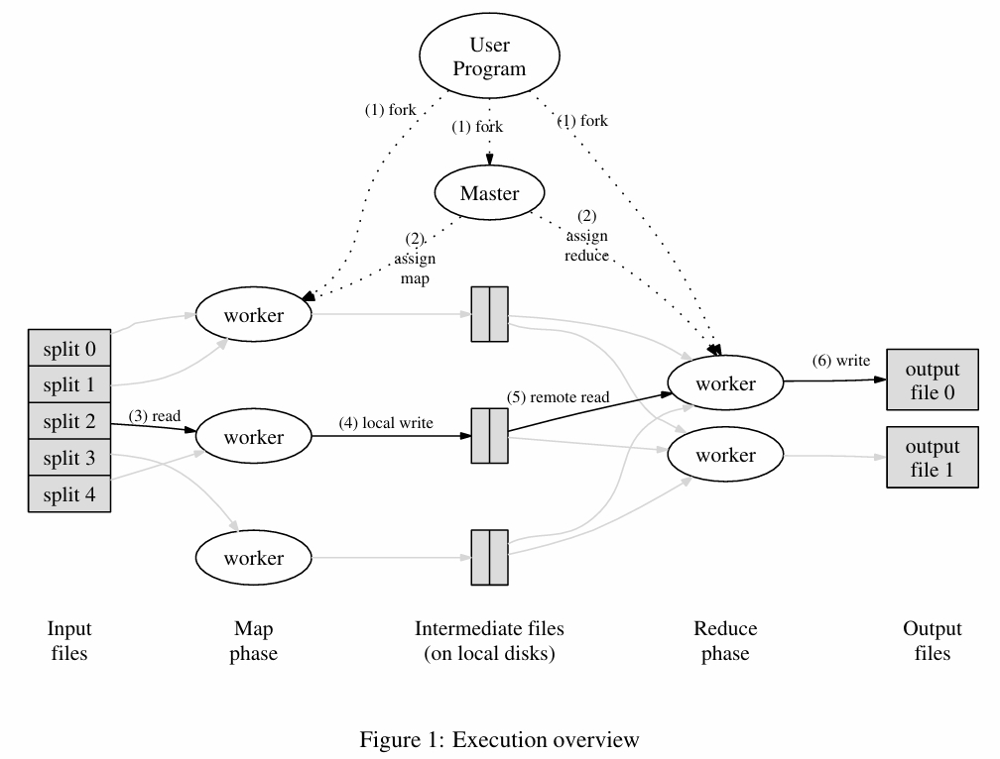

# Lab1 MapReduce


---
- 任务

1. 给定一批输入的书籍，统计每本书每个单词出现的频率

2. 背景是在海量数据的情况下，也要求能够快速高效的处理

---

- 技术选型

  采用MapReduce进行海量数据处理，用分而治之的思想，先使用Map操作，分散程序中间结果，最后用reduce操作，将中间结果合并，产生最终输出。
---
- 具体实现

1. 首先预定义一些基本参数，NReduce表示Map函数输出的中间文件的个数。

2. 对于每一个输入的文件，Map操作会计算每个单词的哈希值，若以n表示该哈希值对NReduce取模的结果。则该单词会被输出到该Map操作产生的第n个中间文件中。

mapf已在课程源代码直接给出，即直接将每个单词拆成KV对拼接起来，关键在于根据哈希值映射放入对应的中间文件。
```
func handleMap(task Task, mapf MapF) error {
	filename := task.Map.Filename
	file, err := os.Open(filename)
	if err != nil {
		log.Fatalf("cannot open %v", filename)
	}
	content, err := ioutil.ReadAll(file)
	if err != nil {
		log.Fatalf("cannot read %v", filename)
	}
	defer file.Close()

	kva := mapf(filename, string(content))
	var encoders []*json.Encoder
	for i := 0; i < task.NReduce; i++ {
		f, err := os.Create(fmt.Sprintf("mr-%d-%d", task.Map.Id, i))
		if err != nil {
			log.Fatalf("cannot create intermediate result file")
		}
		encoders = append(encoders, json.NewEncoder(f))
	}

	for _, kv := range kva {
		_ = encoders[ihash(kv.Key) % task.NReduce].Encode(&kv)
	}
	call("Coordinator.Finish", &FinishArgs{IsMap: true, Id: task.Map.Id}, &PlaceHolder{})
	return nil
}
```
3. 当所有的文件都执行完Map操作以后，程序开始执行Reduce操作。其中，会执行NReduce次Reduce操作，第i次（0<=i<=NReduce）Reduce操作都会收集所有输入文件产生的第i+1个中间文件的结果。
```
func handleReduce(task Task, reducef ReduceF) error {
	var kva []KeyValue
	for _, filename := range task.Reduce.IntermediateFilenames {
		iFile, err := os.Open(filename)
		if err != nil {
			log.Fatalf("cannot open %v", filename)
		}
		dec := json.NewDecoder(iFile)
		for {
			var kv KeyValue
			if err := dec.Decode(&kv); err != nil {
				break
			}
			kva = append(kva, kv)
		}
		err = iFile.Close()
		if err != nil {
			log.Fatalf("cannot close %v", filename)
		}
	}
	sort.Sort(ByKey(kva))
	oname := fmt.Sprintf("mr-out-%d", task.Reduce.Id)
	temp, err := os.CreateTemp(".", oname)
	if err != nil {
		log.Fatalf("cannot create reduce result tempfile %s", oname)
		return err
	}

	i := 0
	for i < len(kva) {
		j := i + 1
		for j < len(kva) && kva[i].Key == kva[j].Key {
			j++
		}
		var values []string
		for k := i; k < j; k++ {
			values = append(values, kva[k].Value)
		}
		output := reducef(kva[i].Key, values)

		_, _ = fmt.Fprintf(temp, "%v %v\n", kva[i].Key, output)

		i = j
	}
	err = os.Rename(temp.Name(), oname)
	if err != nil {
		return err
	}
	call("Coordinator.Finish", &FinishArgs{IsMap: false, Id: task.Reduce.Id}, &PlaceHolder{})
	return nil
}
```